# vaultwarden_DevOPS
O repositório tem como objetivo provisionar e executar o Vaultwarden na AWS, utilizando Terraform para infraestrutura como código e Docker para empacotamento da aplicação. O Vaultwarden é uma implementação alternativa (não oficial) do Bitwarden, escrita em Rust, amplamente usada por ser mais leve e adequada a ambientes pequenos.

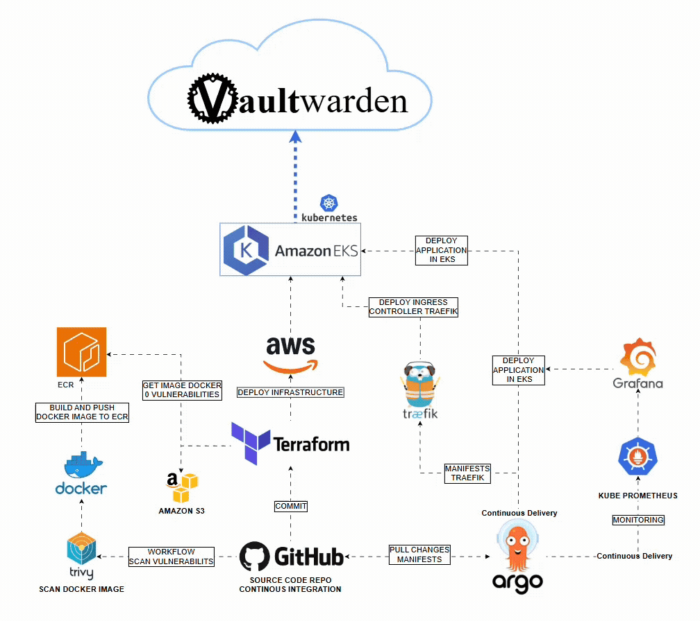


## Principais Tecnologias Utilizadas

- **Terraform** – Provisionamento de infraestrutura na AWS  
- **AWS EC2** – Execução da aplicação  
- **Docker** – Containerização do Vaultwarden  
- **GitHub Actions** – Automação do deploy  
- **AWS CLI / IAM** – Autenticação e permissões

- Deploy automatizado na AWS
- Uso de Terraform para provisionamento
- Execução de aplicações containerizadas

## Visão Geral

Este repositório tem como objetivo provisionar e executar o **Vaultwarden** na **AWS**, utilizando **Terraform** como ferramenta de Infraestrutura como Código (IaC) e **Docker** para containerização da aplicação.

O projeto é voltado principalmente para **estudo, laboratório e uso pessoal**, demonstrando boas práticas básicas de automação de infraestrutura e deploy contínuo.

---

## O que é o Vaultwarden

Vaultwarden é uma implementação alternativa (não oficial) do Bitwarden, escrita em Rust, conhecida por ser:
- Mais leve
- Menos exigente em recursos
- Ideal para ambientes pequenos ou self-hosted

---

## Estrutura do Repositório

### 📁 `terraform/`
Contém os arquivos responsáveis por criar a infraestrutura na AWS. Em geral, essa infraestrutura inclui:

- Provider AWS
- Instância EC2
- Security Group com liberação de portas HTTP/HTTPS
- Variáveis e outputs
- Scripts de inicialização (user data) para instalar Docker e subir o Vaultwarden

---

### 📁 Docker / Dockerfile
Responsável por:
- Definir a imagem do Vaultwarden
- Configurar portas e volumes
- Permitir execução local ou na EC2

---

### ⚙️ GitHub Actions (`.github/workflows`)
Workflow que:
- Faz checkout do repositório
- Configura credenciais da AWS via Secrets
- Executa comandos do Terraform (`init`, `plan`, `apply`)


O repositório está com 80% concluído. Em breve irei concluí-lo!

-----------------------

## DEPLOY

Execute o workflow **Terraform Deployment** para efetuar o Deploy da aplicação na AWS.


Após o workflow concluído, posso verificar o deploy na AWS CLI.
Com o kubectl já instalado, vou me conectar ao Cluster.

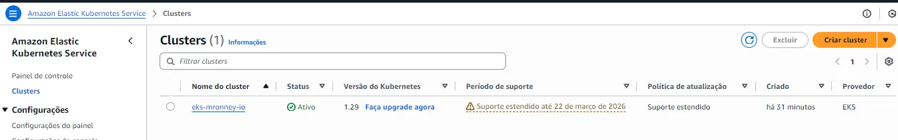

```
aws eks update-kubeconfig —region us-east-1 —name eks-mronney-io
```

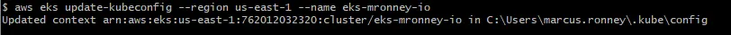

Posso verificar o Cluster EKS iniciado.

`aws eks list-clusters`


Visualizando todas as regiões

```jsx
aws ec2 describe-regions --output table
```


Instâncias EC2

```jsx
aws ec2 describe-instances \
  --query "Reservations[].Instances[].{ID:InstanceId,State:State.Name,Type:InstanceType,AZ:Placement.AvailabilityZone}" \
  --output table
```


Também posso fazer uma Query para passar em todas as regiões e retornar onde possuí Volumes

```jsx
for r in $(aws ec2 describe-regions --query "Regions[].RegionName" --output text); do
  echo "=== EBS em $r ==="
  aws ec2 describe-volumes --region $r \
    --query "Volumes[].{ID:VolumeId,State:State,Size:Size}" \
    --output table
done

```


Elastic IPs

```jsx
for r in $(aws ec2 describe-regions --query "Regions[].RegionName" --output text); do
  echo "=== EIP em $r ==="
  aws ec2 describe-addresses --region $r --output table
done
```


NAT Gateways

```jsx
for r in $(aws ec2 describe-regions --query "Regions[].RegionName" --output text); do
  echo "=== NAT em $r ==="
  aws ec2 describe-nat-gateways --region $r \
    --query "NatGateways[].{ID:NatGatewayId,State:State}" \
    --output table
done
```


Load Balancers

```jsx
for r in $(aws ec2 describe-regions --query "Regions[].RegionName" --output text); do
  echo "=== LB em $r ==="
  aws elbv2 describe-load-balancers --region $r \
    --query "LoadBalancers[].{Name:LoadBalancerName,Type:Type}" \
    --output table
done
```


EKS

```jsx
for r in $(aws ec2 describe-regions --query "Regions[].RegionName" --output text); do
  echo "=== EKS em $r ==="
  aws eks list-clusters --region $r --output table
done
```


VPCs

```jsx
aws ec2 describe-vpcs \
  --query "Vpcs[].{VPC:VpcId,CIDR:CidrBlock}" \
  --output table
```


Subnets

```jsx
aws ec2 describe-subnets \
  --query "Subnets[].{Subnet:SubnetId,AZ:AvailabilityZone,CIDR:CidrBlock}" \
  --output table
```


### # Cluster Rodando.

Agora posso acessar meu kubernetes via CLI

```jsx
aws eks update-kubeconfig --region us-east-1 --name eks-mronney-io
```


Verificando PODs

```jsx
kubectl get pods -A
```


# # Deploy Kubernetes com ArgoCD

Primeiramente, irei verificar os serviços do ArgoCD.

```
kubectl get svc -n argocd
```


Antes de entrar no ArgoCD, preciso obter a senha criptografada.

Para isso, irei ver os secrets do Argocd.

```jsx
 kubectl get secrets -n argocd
```


Irei exporta em yaml as secrets de argocd-initial-admin-secret

```jsx
kubectl get secrets argocd-initial-admin-secret -o yaml -n argocd
```


O password vem cripgrafado, para descriptografar irei fazer em base64

```jsx
echo "ZEJiSXo4UUozYWZQclBmUA==" | base64 --decode
```

Senha descriptografada.


Irei expor o Service do ArgoCD, como o Service está como ClusterIP, ele não está acessível da rede Externa. Irei usar um Port-Foward para fazer um tunel direto da minha máquina pela porta 80.

```jsx
kubectl get svc -n argocd
```


Port-Foward

```jsx
kubectl port-forward svc/argocd-server -n argocd 8080:80
```


Agora ao acessar [http://127.0.0.1:8080/](http://127.0.0.1:8080/) eu tenho acesso ao ArgoCD, posso logar usando a senha que acabei de descriptografar.


ArgoCD Deployado. Agora irei efetuar o deploy dos manifest do Kubernetes que estão em kubernetes/*


### SECRET Regcred

Para efetuar o deploy da aplicação vaultwarden, irei criar a Namespace vaultwarden. Também irei criar um Secret do Docker Registry para quando a aplicação subir, irá se conectar ao ECR. O Secret regcred é um ImagePullSecret do K8s, ele server para autenticar as imagens em um registro privado, no meu caso estou usando o AWS ECR.

O Secret Regcred é declarado dentro do deployment.yaml em spec: imagePullSecrets: -name: regcred. O Comando kubectl create secret docker-registry cria um Secret do tipo 
• [`kubernetes.io/dockerconfigjson`](http://kubernetes.io/dockerconfigjson) na AWS ECR, como já configurei o AWS CLI, basta passar as credenciais como váriaveis para o comando logar e criar um secret, o comando cria um Token válido por 12 horas.

```jsx
kubectl create namespace vaultwarden
```

```jsx
export AWS_REGION="us-east-1"
export AWS_ACCOUNT_ID="$(aws sts get-caller-identity --query Account --output text)"
export SECRET_NAME="regcred"

kubectl create secret docker-registry "$SECRET_NAME" \
  --docker-server="$AWS_ACCOUNT_ID.dkr.ecr.$AWS_REGION.amazonaws.com" \
  --docker-username=AWS \
  --docker-password="$(aws ecr get-login-password --region $AWS_REGION)" \
  -n vaultwarden
secret/regcred created

```


Vou adicionar um NEW APP para se conectar com meu repositório seguindo configurações abaixo:


ArgoCD acessou os Charts do Repositório e efetuou o Deploy com sucesso.


Irei verificar o Deploy no AWS CLI

Verificando o Secret na namespace vaultwarden, esse secret está guardando as credenciais do ECR, assim o Kubernetes terá acesso.

```jsx
kubectl -n vaultwarden get secret regcred
```


Verificando o IngressRoute na namespace vaultwarden. Ele cria uma rota que diz para qual service o kubernetes deve encaminhar.

```jsx
kubectl -n vaultwarden get ingressroute
```


```jsx
kubectl -n vaultwarden get ingressroute -o yaml
NAME                  AGE
vaultwarden-ingress   11m
apiVersion: v1
items:
- apiVersion: traefik.containo.us/v1alpha1
  kind: IngressRoute
  metadata:
    annotations:
      cert-manager.io/cluster-issuer: letsencrypt
      kubectl.kubernetes.io/last-applied-configuration: |
        {"apiVersion":"traefik.containo.us/v1alpha1","kind":"IngressRoute","metadata":{"annotations":{"cert-manager.io/cluster-issuer":"letsencrypt","kubernetes.io/ingress.class":"traefik-external","traefik.ingress.kubernetes.io/router.entrypoints":"websecure","traefik.ingress.kubernetes.io/router.middlewares":"basic-auth@kubernetescrd","traefik.ingress.kubernetes.io/router.tls":"true"},"labels":{"argocd.argoproj.io/instance":"vaultwarden"},"name":"vaultwarden-ingress","namespace":"vaultwarden"},"spec":{"entryPoints":["websecure"],"routes":[{"kind":"Rule","match":"Host(`example.com`) \u0026\u0026 PathPrefix(`/`)","services":[{"name":"vaultwarden-service","port":80}]}],"tls":{"secretName":"letsencrypt2"}}}
      kubernetes.io/ingress.class: traefik-external
      traefik.ingress.kubernetes.io/router.entrypoints: websecure
      traefik.ingress.kubernetes.io/router.middlewares: basic-auth@kubernetescrd
      traefik.ingress.kubernetes.io/router.tls: "true"
    creationTimestamp: "2026-01-30T00:08:37Z"
    generation: 1
    labels:
      argocd.argoproj.io/instance: vaultwarden
    name: vaultwarden-ingress
    namespace: vaultwarden
    resourceVersion: "9147"
    uid: 7c24eef3-44b6-4917-897c-9aa4d01414f8
  spec:
    entryPoints:
    - websecure
    routes:
    - kind: Rule
      match: Host(`vault.ronney.tech`) && PathPrefix(`/`)
      services:
      - name: vaultwarden-service
        port: 80
    tls:
      secretName: letsencrypt2
kind: List
metadata:
  resourceVersion: ""
```

Listando os objetos dentro do ArgoCD.

```jsx
kubectl get applications -n argocd
```


Note que o HELTH STATUS é Degraded, isso se deve porque o Secret TLS está aguardando a URL da Amazon apontar para o DNS “vault.ronney.tech” declarado em certificate.tf. Posteriormente irei criar um DNS apontando para a AWS, após isso o ArgoCD irá recriar o Certificate.

kubernetes/certificate.yaml

```jsx
commonName: vault.ronney.tech
  dnsNames:
    - vault.ronney.tech
```

Verificando Certificado, note que o Status está como False

```jsx
kubectl -n vaultwarden describe certificate vaultwarden-cert2
```


Verificando Pod do Traefik

```jsx
kubectl -n traefik get pods
```


Verificando o Traefik, no campo EXTERNAL-IP eu tenho a URL da AWS

```jsx
kubectl -n traefik get svc traefik
```

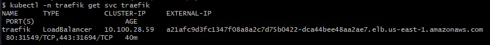

Irei usar um Dominio Registrado para criar um DNS Cname para apontar para esse endereço da AWS


Verificando Secret

```jsx
kubectl -n vaultwarden get secret letsencrypt2
```


```jsx
kubectl -n vaultwarden get certificaterequest,order,challenge
```


Note que o Certificado agora está como True.

Após o Cname se propagar, o ArgoCD irá Sincronizar novamente e acabar o Deploy do Certificado


O Curl já retorna a resolução de nome feita com sucesso e certificado Válido

```jsx
curl -v http://vault.ronney.tech
```


# Aplicação Deployada com sucesso

Todos os Pods executando com sucesso


Certificado


# Monitoring - Prometheus e Grafana

O Deploy do Kube-Prometheus está sendo feito através do helm charts dentro do helm.tf

Helm Charts = charts/kube-prometheus-stack/README.md

````
module "KUBE_PROMETHEUS_STACK" {
  source = "./_modules/helm-release"

  namespace  = "monitoring"
  repository = "https://prometheus-community.github.io/helm-charts"

  app = {
    create_namespace = true
    name             = "kube-prometheus-stack"
    chart            = "kube-prometheus-stack"
    version          = "56.6.2" # exemplo; fixe uma versão válida pro seu cenário
    force_update     = true
    wait             = true
    recreate_pods    = true
    timeout          = var.timeout_seconds
  }

````

A pipeline subiu os charts do Prometheus

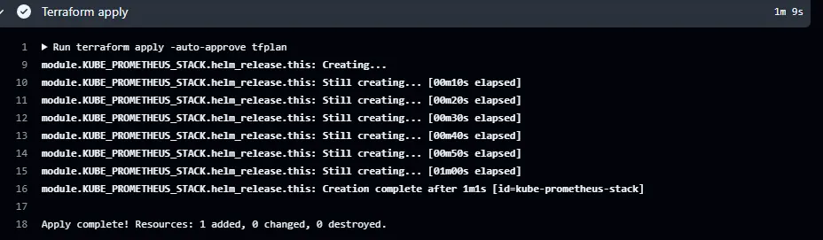

Já consigo verificar os Pods e Services na namespace **monitoring**.

```jsx
kubectl get pods -n monitoring
kubectl get svc -n monitoring
```

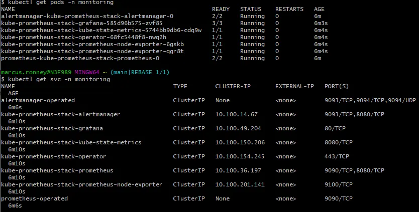


Serviços rodando, agora irei expor os Services do Prometheus e Grafana.

```jsx
 kubectl port-forward svc/kube-prometheus-stack-grafana  3000:80 -n monitoring
```

```jsx
kubectl port-forward svc/kube-prometheus-stack-prometheus 8000:9090 -n monitoring
```

Grafana e Prometheus Acessados.

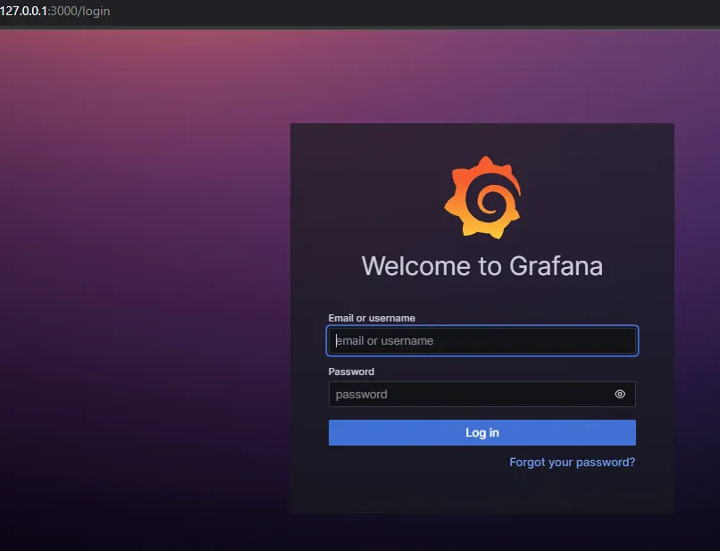

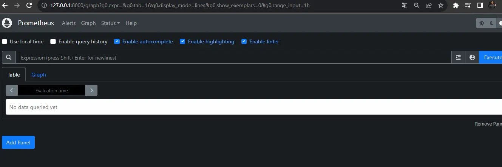

Para logar no grafana, use o usuário **admin** e adquira a senha **prom-operator**.


```jsx
kubectl get secret --namespace monitoring kube-prometheus-stack-grafana  -o jsonpath="{.data.admin-password}" | base64 --decode ; echo
```

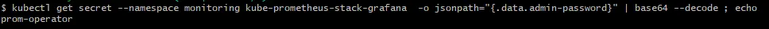

A Stack do Prometheus Operator já possuem as dashboards prontas.

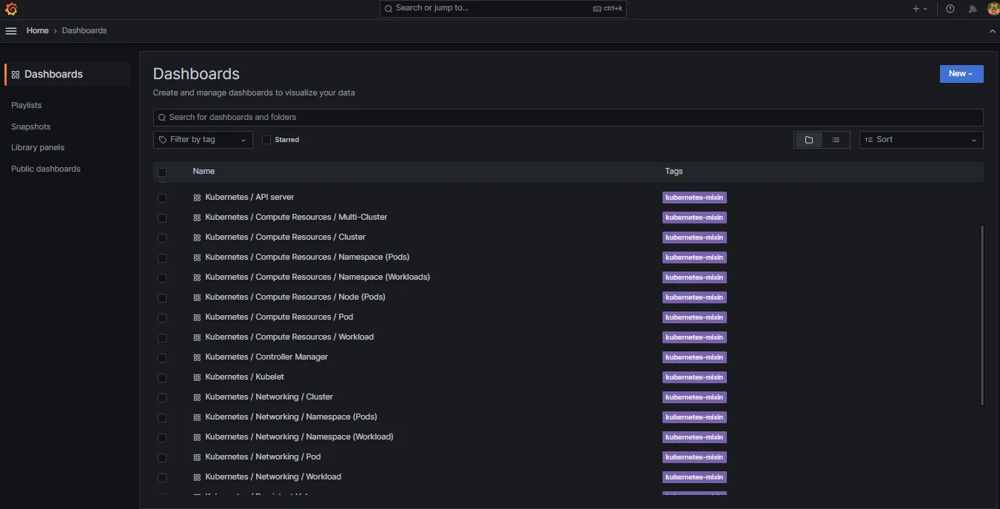

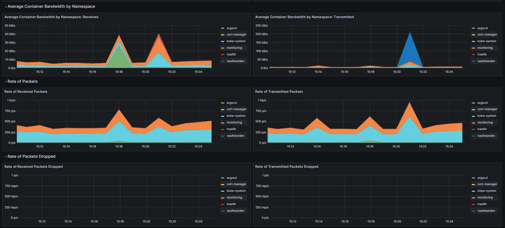

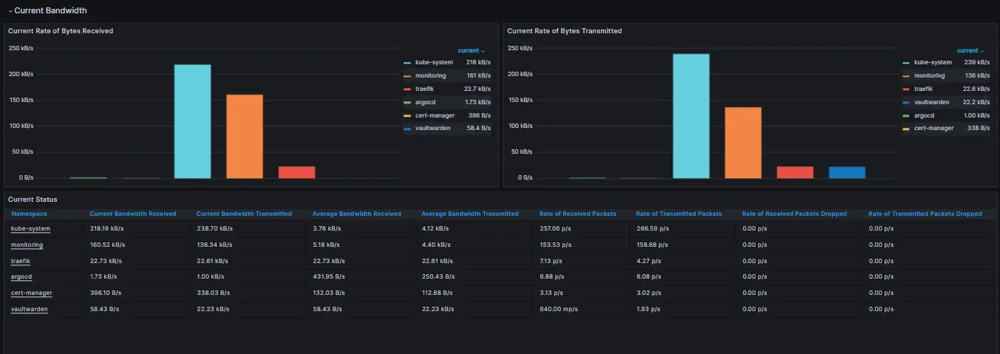

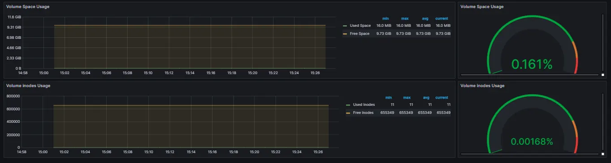

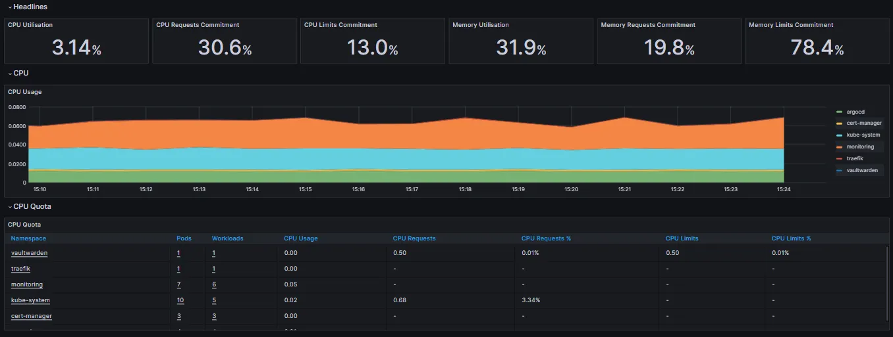


